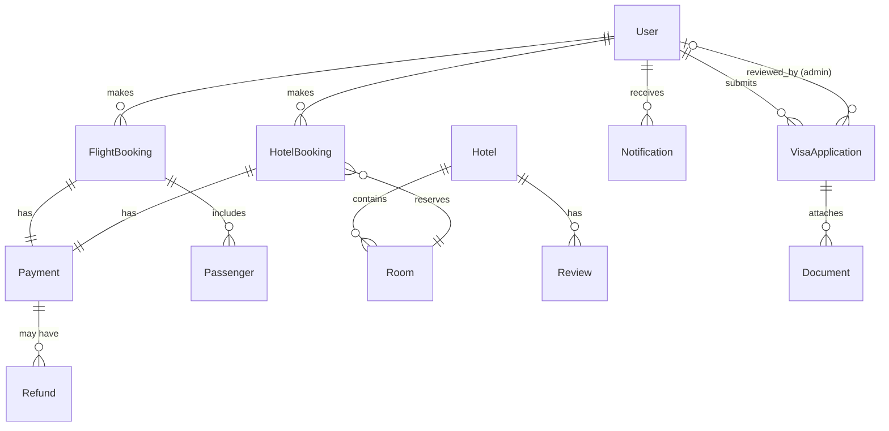

# Data Model: Integrated Travel Platform

**Date**: 2026-05-30
**Branch**: `001-travel-platform-backend`

## Entity Relationship Overview



---

## Entities

### User

Represents both travelers and admin users. Discriminated by `role`.

| Field | Type | Constraints | Notes |
|-------|------|-------------|-------|
| id | UUID | PK, auto-generated | |
| email | String | Unique, not null | Login identifier |
| passwordHash | String | Not null | bcrypt (12 rounds) |
| firstName | String | Not null | |
| lastName | String | Not null | |
| phone | String | Nullable | |
| nationality | String | Nullable | Required for visa applications |
| passportNumber | String | Nullable | Required for visa applications |
| role | Enum(UserRole) | Not null, default: TRAVELER | TRAVELER, BOOKING_AGENT, VISA_REVIEWER, FINANCE_VIEWER, SUPER_ADMIN |
| locale | Enum(Locale) | Not null, default: AR | AR, EN |
| isActive | Boolean | Not null, default: true | Soft deactivation |
| refreshToken | String | Nullable | Hashed refresh token |
| createdAt | DateTime | Not null, auto | |
| updatedAt | DateTime | Not null, auto | |

**Indexes**: `email` (unique), `role`

---

### FlightBooking

A confirmed or pending flight reservation.

| Field | Type | Constraints | Notes |
|-------|------|-------------|-------|
| id | UUID | PK, auto-generated | |
| reference | String | Unique, not null | Human-readable ref (e.g., TT-FL-XXXXXX) |
| userId | UUID | FK → User, not null | Traveler who booked |
| origin | String | Not null | IATA airport code |
| destination | String | Not null | IATA airport code |
| departureDate | DateTime | Not null | |
| returnDate | DateTime | Nullable | Null for one-way |
| airline | String | Not null | |
| cabinClass | Enum(CabinClass) | Not null | ECONOMY, BUSINESS, FIRST |
| totalAmount | Decimal | Not null | In SAR |
| currency | String | Not null, default: SAR | |
| status | Enum(BookingStatus) | Not null, default: PENDING | PENDING, CONFIRMED, CANCELLED, REFUNDED |
| eTicketRef | String | Nullable | Generated on confirmation |
| providerRef | String | Nullable | GDS provider reference |
| paymentId | UUID | FK → Payment, nullable | |
| cancelledAt | DateTime | Nullable | |
| cancellationReason | String | Nullable | |
| createdAt | DateTime | Not null, auto | |
| updatedAt | DateTime | Not null, auto | |

**Indexes**: `reference` (unique), `userId`, `status`, `departureDate`

---

### Passenger

Passenger details associated with a flight booking.

| Field | Type | Constraints | Notes |
|-------|------|-------------|-------|
| id | UUID | PK, auto-generated | |
| flightBookingId | UUID | FK → FlightBooking, not null | |
| firstName | String | Not null | As on passport |
| lastName | String | Not null | As on passport |
| passportNumber | String | Not null | |
| nationality | String | Not null | |
| dateOfBirth | DateTime | Not null | |
| type | Enum(PassengerType) | Not null | ADULT, CHILD, INFANT |
| createdAt | DateTime | Not null, auto | |

**Indexes**: `flightBookingId`

---

### Hotel

A bookable hotel property.

| Field | Type | Constraints | Notes |
|-------|------|-------------|-------|
| id | UUID | PK, auto-generated | |
| name | String | Not null | |
| nameAr | String | Nullable | Arabic name |
| city | String | Not null | |
| country | String | Not null, default: SA | |
| address | String | Not null | |
| starRating | Int | Not null, 1–5 | |
| description | Text | Nullable | |
| descriptionAr | Text | Nullable | Arabic description |
| amenities | String[] | Not null, default: [] | Array of amenity tags |
| photos | String[] | Not null, default: [] | Array of S3 URLs |
| averageRating | Decimal | Nullable | Computed from reviews |
| reviewCount | Int | Not null, default: 0 | |
| isActive | Boolean | Not null, default: true | |
| providerRef | String | Nullable | External provider ID |
| createdAt | DateTime | Not null, auto | |
| updatedAt | DateTime | Not null, auto | |

**Indexes**: `city`, `starRating`, `isActive`

---

### Room

A bookable room type within a hotel.

| Field | Type | Constraints | Notes |
|-------|------|-------------|-------|
| id | UUID | PK, auto-generated | |
| hotelId | UUID | FK → Hotel, not null | |
| type | String | Not null | e.g., "Standard Double", "Suite" |
| typeAr | String | Nullable | Arabic room type name |
| capacity | Int | Not null | Max guests |
| pricePerNight | Decimal | Not null | In SAR |
| currency | String | Not null, default: SAR | |
| totalInventory | Int | Not null | Total rooms of this type |
| description | Text | Nullable | |
| photos | String[] | Not null, default: [] | |
| isActive | Boolean | Not null, default: true | |
| createdAt | DateTime | Not null, auto | |
| updatedAt | DateTime | Not null, auto | |

**Indexes**: `hotelId`, `pricePerNight`

---

### HotelBooking

A confirmed or pending hotel reservation.

| Field | Type | Constraints | Notes |
|-------|------|-------------|-------|
| id | UUID | PK, auto-generated | |
| reference | String | Unique, not null | Human-readable ref (e.g., TT-HT-XXXXXX) |
| userId | UUID | FK → User, not null | |
| hotelId | UUID | FK → Hotel, not null | |
| roomId | UUID | FK → Room, not null | |
| checkIn | DateTime | Not null | |
| checkOut | DateTime | Not null | |
| guestCount | Int | Not null | |
| nights | Int | Not null | Computed: checkOut - checkIn |
| totalAmount | Decimal | Not null | In SAR |
| currency | String | Not null, default: SAR | |
| status | Enum(BookingStatus) | Not null, default: PENDING | PENDING, CONFIRMED, CANCELLED, REFUNDED |
| paymentId | UUID | FK → Payment, nullable | |
| cancelledAt | DateTime | Nullable | |
| cancellationReason | String | Nullable | |
| createdAt | DateTime | Not null, auto | |
| updatedAt | DateTime | Not null, auto | |

**Indexes**: `reference` (unique), `userId`, `hotelId`, `status`, `checkIn`

---

### Review

Guest review for a hotel.

| Field | Type | Constraints | Notes |
|-------|------|-------------|-------|
| id | UUID | PK, auto-generated | |
| hotelId | UUID | FK → Hotel, not null | |
| userId | UUID | FK → User, not null | |
| rating | Int | Not null, 1–5 | |
| title | String | Nullable | |
| body | Text | Nullable | |
| createdAt | DateTime | Not null, auto | |

**Indexes**: `hotelId`, `userId`, `rating`

---

### VisaApplication

An Umrah visa application with document attachments.

| Field | Type | Constraints | Notes |
|-------|------|-------------|-------|
| id | UUID | PK, auto-generated | |
| reference | String | Unique, not null | Human-readable ref (e.g., TT-VS-XXXXXX) |
| userId | UUID | FK → User, not null | Applicant |
| fullName | String | Not null | As on passport |
| passportNumber | String | Not null | |
| nationality | String | Not null | |
| dateOfBirth | DateTime | Not null | |
| status | Enum(VisaStatus) | Not null, default: PENDING | PENDING, UNDER_REVIEW, APPROVED, REJECTED, SUBMITTED_TO_MAQAM, MAQAM_ACCEPTED, MAQAM_REJECTED |
| reviewerId | UUID | FK → User, nullable | Admin who reviewed |
| reviewerNotes | Text | Nullable | Internal admin notes |
| rejectionReason | Text | Nullable | Shared with applicant |
| maqamReference | String | Nullable | External Maqam tracking ID |
| maqamSubmittedAt | DateTime | Nullable | |
| maqamResponseAt | DateTime | Nullable | |
| createdAt | DateTime | Not null, auto | |
| updatedAt | DateTime | Not null, auto | |

**State transitions**:
```
PENDING → UNDER_REVIEW → APPROVED → SUBMITTED_TO_MAQAM → MAQAM_ACCEPTED
                       → REJECTED                      → MAQAM_REJECTED
```

**Indexes**: `reference` (unique), `userId`, `status`, `reviewerId`

---

### Document

Uploaded file attached to a visa application.

| Field | Type | Constraints | Notes |
|-------|------|-------------|-------|
| id | UUID | PK, auto-generated | |
| visaApplicationId | UUID | FK → VisaApplication, not null | |
| type | Enum(DocumentType) | Not null | PASSPORT_SCAN, PERSONAL_PHOTO |
| fileName | String | Not null | Original filename |
| mimeType | String | Not null | image/jpeg, image/png |
| sizeBytes | Int | Not null | Max 5 MB (5242880) |
| storageKey | String | Not null | S3 object key |
| validationStatus | Enum(ValidationStatus) | Not null, default: PENDING | PENDING, VALID, INVALID |
| validationMessage | String | Nullable | Error details if invalid |
| createdAt | DateTime | Not null, auto | |

**Indexes**: `visaApplicationId`, `type`

---

### Payment

A financial transaction linked to a booking.

| Field | Type | Constraints | Notes |
|-------|------|-------------|-------|
| id | UUID | PK, auto-generated | |
| reference | String | Unique, not null | TT-PY-XXXXXX |
| amount | Decimal | Not null | |
| currency | String | Not null, default: SAR | |
| method | Enum(PaymentMethod) | Not null | CREDIT_CARD, MADA, APPLE_PAY |
| status | Enum(PaymentStatus) | Not null, default: PENDING | PENDING, COMPLETED, FAILED, REFUNDED |
| gatewayRef | String | Nullable | Moyasar transaction ID |
| gatewayResponse | JSON | Nullable | Raw gateway response |
| bookingType | Enum(BookingType) | Not null | FLIGHT, HOTEL |
| bookingId | UUID | Not null | Polymorphic FK to FlightBooking or HotelBooking |
| paidAt | DateTime | Nullable | |
| failedAt | DateTime | Nullable | |
| failureReason | String | Nullable | |
| createdAt | DateTime | Not null, auto | |
| updatedAt | DateTime | Not null, auto | |

**Indexes**: `reference` (unique), `status`, `bookingType + bookingId`, `paidAt`

---

### Refund

A refund issued against a payment.

| Field | Type | Constraints | Notes |
|-------|------|-------------|-------|
| id | UUID | PK, auto-generated | |
| paymentId | UUID | FK → Payment, not null | |
| amount | Decimal | Not null | May be partial |
| reason | String | Not null | |
| status | Enum(RefundStatus) | Not null, default: PENDING | PENDING, PROCESSED, FAILED |
| gatewayRef | String | Nullable | |
| processedAt | DateTime | Nullable | |
| createdAt | DateTime | Not null, auto | |

**Indexes**: `paymentId`, `status`

---

### Notification

An in-app notification for a user.

| Field | Type | Constraints | Notes |
|-------|------|-------------|-------|
| id | UUID | PK, auto-generated | |
| userId | UUID | FK → User, not null | |
| type | Enum(NotificationType) | Not null | VISA_STATUS, BOOKING_CONFIRMED, BOOKING_CANCELLED, PAYMENT_RECEIVED, SYSTEM |
| title | String | Not null | |
| body | Text | Not null | |
| data | JSON | Nullable | Contextual metadata (e.g., bookingRef, visaRef) |
| isRead | Boolean | Not null, default: false | |
| createdAt | DateTime | Not null, auto | |

**Indexes**: `userId + isRead`, `type`, `createdAt`

---

## Enums

| Enum | Values |
|------|--------|
| UserRole | TRAVELER, BOOKING_AGENT, VISA_REVIEWER, FINANCE_VIEWER, SUPER_ADMIN |
| Locale | AR, EN |
| CabinClass | ECONOMY, BUSINESS, FIRST |
| BookingStatus | PENDING, CONFIRMED, CANCELLED, REFUNDED |
| PassengerType | ADULT, CHILD, INFANT |
| VisaStatus | PENDING, UNDER_REVIEW, APPROVED, REJECTED, SUBMITTED_TO_MAQAM, MAQAM_ACCEPTED, MAQAM_REJECTED |
| DocumentType | PASSPORT_SCAN, PERSONAL_PHOTO |
| ValidationStatus | PENDING, VALID, INVALID |
| PaymentMethod | CREDIT_CARD, MADA, APPLE_PAY |
| PaymentStatus | PENDING, COMPLETED, FAILED, REFUNDED |
| BookingType | FLIGHT, HOTEL |
| RefundStatus | PENDING, PROCESSED, FAILED |
| NotificationType | VISA_STATUS, BOOKING_CONFIRMED, BOOKING_CANCELLED, PAYMENT_RECEIVED, SYSTEM |
